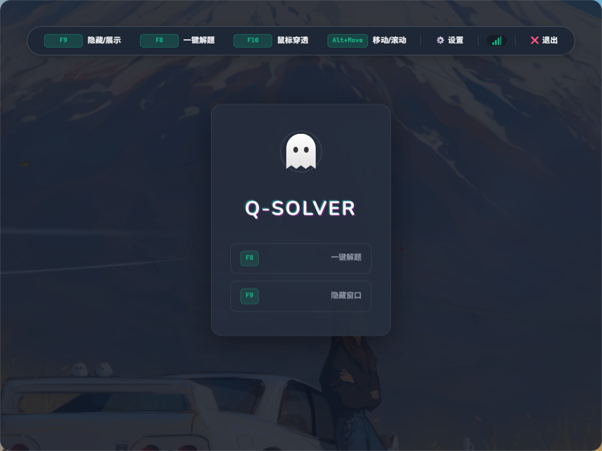
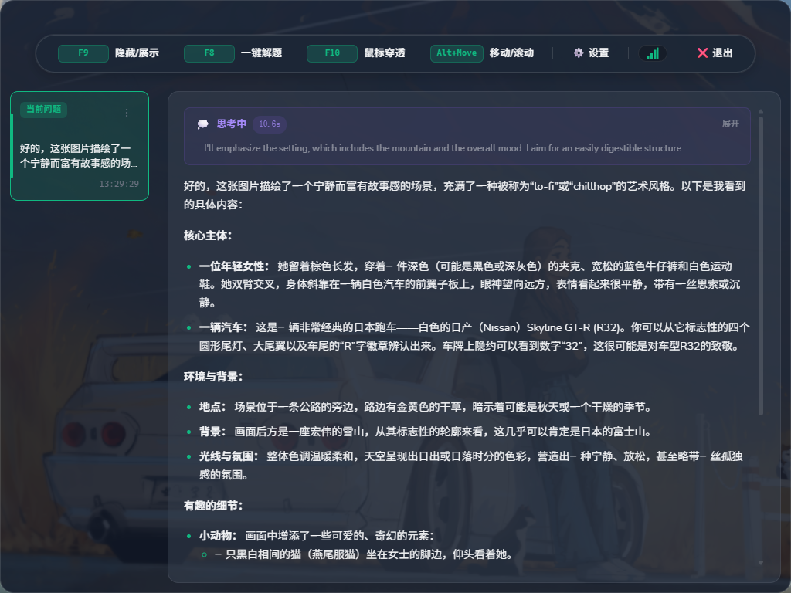
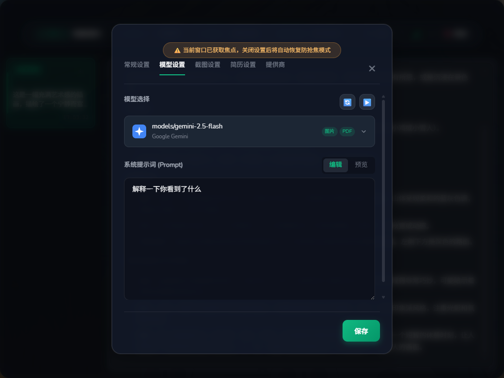
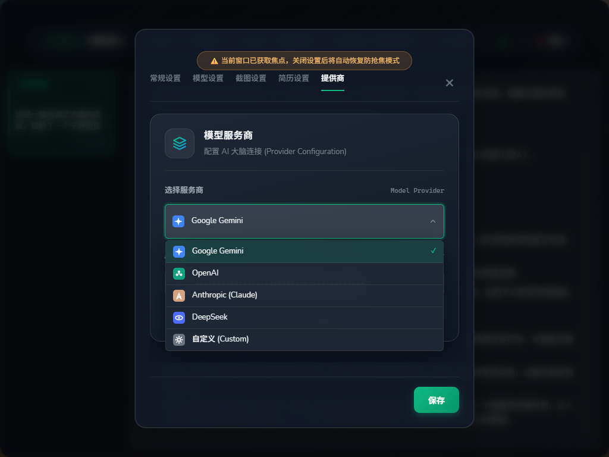

<div align="center">
  

  <h1>Q-Solver</h1>
  <p>一个支持截图识别的桌面 AI 助手</p>

  <p>
    
    
    
    
  </p>

  <p>
    <a href="#截图">截图</a> •
    <a href="#功能特性">功能</a> •
    <a href="#安装">安装</a> •
    <a href="#配置">配置</a> •
    <a href="#快捷键">快捷键</a>
  </p>
</div>

---

## 截图

<p align="center">
  
  
</p>
<p align="center">
  
  
</p>

## 功能特性

- **截图问答**：通过快捷键截取屏幕内容，发送给 AI 进行分析
- **多模型支持**：兼容 OpenAI、Google Gemini、Anthropic Claude 等主流 API
- **透明悬浮窗**：可调节窗口透明度，支持鼠标穿透
- **简历辅助**：可导入 PDF 简历，AI 回答时会参考简历内容
- **上下文记忆**：支持多轮对话，可选择是否保留历史上下文
- **全局快捷键**：无需切换窗口，快捷键直接触发

## 安装

### 下载安装包

前往 [Releases](https://github.com/jym66/Q-Solver/releases) 下载最新版本。

### 源码编译

```bash
# 环境要求：Go 1.25+、Node.js 22+、Wails CLI

git clone https://github.com/jym66/Q-Solver.git
cd Q-Solver

# 开发模式
wails dev

# 编译生产版本
wails build
```

### 分支说明

| 分支 | 说明 |
|------|------|
| `main` | 主分支（稳定） |
| `with-voice` | 带语音识别功能（实验性） |

## 配置

1. 启动软件，点击设置图标
2. 填入 API Key（支持 OpenAI 格式的 API）
3. 选择模型
4. 可选：导入简历 PDF

> 获取 Gemini API Key：https://aistudio.google.com/app/apikey

## 快捷键

| 快捷键 | 功能 |
|--------|------|
| `F8` | 截图并发送分析请求 |
| `F9` | 显示/隐藏窗口 |
| `F10` | 开启/关闭鼠标穿透 |
| `Alt + 方向键` | 移动窗口 |
| `Alt + PgUp/PgDn` | 翻页 |

> 快捷键可在设置中自定义

## 免责声明

本项目仅供学习交流，请勿用于违反法律法规的场景。开发者不对使用本软件产生的任何后果负责。

## License

CC BY-NC 4.0

- ✅ 允许个人学习、修改
- ❌ 禁止商业用途

---

<div align="center">
  <p>Made by <a href="https://github.com/jym66">jym66</a></p>
</div>
